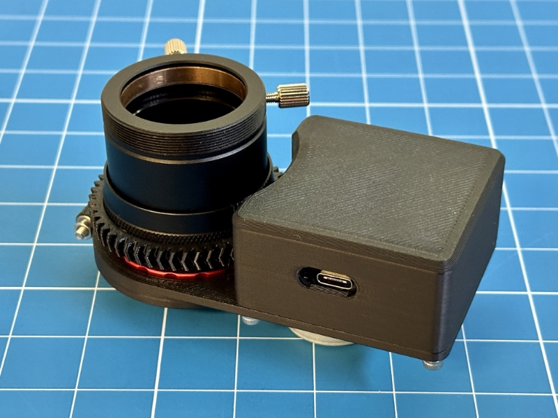

# ASCOM-Compatible OAG Focuser

I do not charge anything to create and maintain these open-source projects. But if you would like to say "thanks" for this project, feel free to send any amount through Paypal using the button below. I appreciate your support!

<!-- toc -->

- [Introduction](#introduction)
  * [Is This For You?](#is-this-for-you)
  * [Use As A Standalone Focuser](#use-as-a-standalone-focuser)
- [Finished Product](#finished-product)
- [Demo](#demo)
- [Pre-Requisites](#pre-requisites)
- [Hardware / BOM](#hardware--bom)
- [ASCOM Driver](#ascom-driver)
  * [Downloading And Installing The Driver](#downloading-and-installing-the-driver)
  * [Compiling The Driver (For Developers Only)](#compiling-the-driver-for-developers-only)
  * [Screenshots](#screenshots)
- [Standalone Focuser Application](#standalone-focuser-application)
- [Arduino Firmware](#arduino-firmware)
  * [Microcontroller Compatibility](#microcontroller-compatibility)
  * [Compiling And Uploading The Firmware](#compiling-and-uploading-the-firmware)
- [Electronic Circuit](#electronic-circuit)
- [Mechanical Components](#mechanical-components)
  * [OAG Compatibility](#oag-compatibility)
  * [Gear And Pinion](#gear-and-pinion)
- [Calibration Procedure](#calibration-procedure)
- [Troubleshooting](#troubleshooting)
- [Frequently Asked Questions (FAQ)](#frequently-asked-questions-faq)
- [Credits](#credits)

<!-- tocstop -->

## Introduction

Shortly after I got started in astrophotography, I noticed that the stars in my images were slightly elongated due to some differential flexure somewhere in my imaging system (see [Cloudy Nights thread](https://www.cloudynights.com/topic/775260-good-guiding-but-elongated-stars-along-e-w-direction/) — I strongly suspect that it is sag in my focuser...) The permanent solution was to switch from using a guide scope to using an off-axis guider (OAG) and that immediately resolved my issue. Now, my stars are perfectly round, which is great! For reference, I purchased the [ZWO OAG](https://astronomy-imaging-camera.com/product/zwo-oag) and the accompanying [ZWO 1.25" helical focuser](https://astronomy-imaging-camera.com/product/zwo-1-25%E2%80%B3-helical-focuser).

As good as this sounds, the OAG brought a number of new challenges which I did not have to deal with before. First, when using an OAG, the field of view is very small, which sometimes makes it difficult for the guiding software to detect guide stars. Second, the OAG requires some amount of refocusing when switching filters. Indeed, filters are not always parfocal. Most importantly, a refractor (even an apochromatic triplet...) will focus various wavelengths at different distances, and this is the primary reason why it is required to change the focus of the main imaging camera (using filter offsets) when changing filters. Unfortunately, while the imaging sensor is located _behind_ the filter wheel, the OAG is always placed _before_ the filter wheel (Otherwise, especially when using narrowband filters, you would not be able to find a single guide star... Also, placing the filter wheel further away from the imaging sensor would cause vignetting...) and this is why, under specific conditions (see "Is this For You" paragraph below), the guide camera might show out-of-focus images while the imaging camera is in focus, and even though the guide camera was independently focused while another filter was selected in the filter wheel.

While guiding software like PHD2 can accommodate slightly out-of-focus guide stars by computing their centroid, out-of-focus guide images can contain a drastically lower number of detected guide stars, and those that are detected will have a much lower Signal to Noise Ratio (SNR), further reducing the accuracy of the centroid computation. In some situations, PHD2 may not even be able to detect a single guide star, and guiding will be impossible. This has happened to me in the past, and I was forced to _manually_ refocus the guide camera (independently of the main imaging camera of course, using the OAG helical focuser)

Manually refocusing the guide camera throughout the night is not exactly one of the most enjoyable parts of the hobby, so I looked for ways to automate that. Pegasus Astro sells a motorized OAG named [SCOPS OAG](https://pegasusastro.com/products/scops-oag/). However, it is a little expensive for me ($750 US — although it is a really great looking unit!) Furthermore, I discussed with the [N.I.N.A.](https://nighttime-imaging.eu/) developers on their [Discord server](https://discord.gg/fwpmHU4). Since N.I.N.A. can only connect to a single focuser at a time, there is no good solution yet to deal with SCOPS OAG. It is certainly possible to run a second instance of N.I.N.A. that connects to both SCOPS OAG and the guide camera, but there is no way to have those two N.I.N.A. instances communicate to do something upon filter change.

All of this has led me to design and build my own solution to this problem. In this repository, you will find everything you need to motorize and automatically control the ZWO OAG (list of parts, 3D model, electronic schematics, Arduino firmware, ASCOM driver, standalone ASCOM client application, instructions, etc.) I hope you consider building this project if you find yourself in a similar situation. Please note that the ASCOM driver can be used with SCOPS OAG, there is nothing in the Filter Wheel Proxy implementation that is specific to my device.

### Is This For You?

Not necessarily! It really depends on a lot of factors. For example, if you are using a mirrored telescope, i.e. not a refractor, and if all of your filters come from the same set, e.g., Antlia LRGB filter set, and the filter manufacturer claims they are parfocal, then you may not need this at all because the difference in focus between filters will be so minuscule, you probably won't need to worry about it. However, if you are using a refractor (even an APO triplet), or if you use filters that are not parfocal, you _may_ need this. The only way to find out is to focus your main imaging camera, and then, assuming that you've already defined your filter offsets, go through every single filter in your filter wheel. After every filter change, your imaging application will adjust the focus of your imaging train slightly depending on the filter offset you have defined for the selected filter, and you should look at the image coming out of your guide camera in PHD2. In my case, the stars in my guide camera can be pinpoint when I am using my Luminance filter, but they are large disks when I am on some other filter. That is how you know that this device can be useful for you. This definitely is not for everybody, but the people who have the problem I just described did not really have a good solution until now.

### Use As A Standalone Focuser

Please note that you can use this device, and the accompanying software, to motorize any helical focuser, regardless of how you use that focuser. For example, you could use it to control the focus of a guide scope or even an entire imaging train! Some people have used this project to motorize the focus of a spectrograph. Just remember that if you have a helical focuser that is not from ZWO, you may need to make a few adjustments to the 3D model...

## Finished Product

Here is what the finished product looks like:

And here it is, attached to the ZWO OAG, and fitted with a guide camera:

## Demo

Here is a demo of the system when attached to my telescope, and used as an OAG focuser:

The following video shows what the guide camera sees with and without the OAG focuser upon switching to a different filter:

## Pre-Requisites

* A Windows computer (Windows 10 or newer)
* [Microsoft Visual Studio](https://visualstudio.microsoft.com/) (FYI, I used the 2022 edition...)
* [ASCOM Platform](https://ascom-standards.org/)
* [ASCOM Platform Developer Components](https://ascom-standards.org/COMDeveloper/Index.htm)
* [Arduino IDE](https://www.arduino.cc/en/software)
* [FreeCAD](https://www.freecadweb.org/), a free and open-source 3D parametric modeler
* A 3D printer able to print PETG, and a slicer (I use a heavily upgraded Creality Ender 3 v2, and Ultimaker Cura)
* A few basic tools that any tinkerer must own, such as a breadboard, a soldering iron, etc.

## Hardware / BOM

* [ZWO 1.25" helical focuser](https://bit.ly/47JOTRL) or equivalent.
* Arduino-compatible microcontroller board with built-in EEPROM support. I used an [Arduino Nano clone with a USB-C connector (~$10 USD on Amazon for a pack of 3...)](https://www.amazon.com/dp/B09DKHWSY9?tag=darkskygeek-20)
* [ULN2003 Darlington transistor array](https://www.amazon.com/dp/B0CBM23ZJ3?tag=darkskygeek-20) to control the stepper motor using the Arduino's digital I/O pins.
* [28BYJ-48 stepper motor (5V)](https://www.amazon.com/dp/B01CP18J4A?tag=darkskygeek-20)
* [LEDs](https://www.amazon.com/dp/B09XDMJ6KY?tag=darkskygeek-20) and [resistors](https://www.amazon.com/dp/B08FD1XVL6?tag=darkskygeek-20) — These are not required, but they can be useful to debug the firmware while prototyping.
* Connectors — I used [JST-XH connectors](https://www.amazon.com/dp/B01MCZE2HM?tag=darkskygeek-20), only because I already had a bunch of them, along with [a crimping tool](https://www.amazon.com/dp/B078WNZ9FW?tag=darkskygeek-20).
* [Capacitors](https://www.amazon.com/dp/B07PBQXQNQ?tag=darkskygeek-20) — Any 10 to 20µF cpacitor should work (this is just a bulk capacitor, so the exact value does not matter)
* [M2 Threaded Inserts](https://www.amazon.com/dp/B0B8GN63S2?tag=darkskygeek-20)
* [M3 Threaded Inserts](https://www.amazon.com/dp/B0BQJ6CRNJ?tag=darkskygeek-20)

## ASCOM Driver

### Downloading And Installing The Driver

Starting with version `1.0.5`, you can install the ASCOM driver, as well as the standalone focuser control application, by running the executable setup file that you will find in the [releases page](https://github.com/jlecomte/ascom-oag-focuser/releases). By default, it places files under `C:\Program Files (x86)\Dark Sky Geek\OAG Focuser ASCOM Driver`.

### Compiling The Driver (For Developers Only)

Open Microsoft Visual Studio as an administrator (right-click on the Microsoft Visual Studio shortcut, and select "Run as administrator"). This is required because when building the code, by default, Microsoft Visual Studio will register the compiled COM components, and this operation requires special privileges (Note: This is something you can disable in the project settings...) Then, open the solution (`ASCOM_Driver\ASCOM.DarkSkyGeek.OAGFocuser.sln`), change the solution configuration to `Release` (in the toolbar), open the `Build` menu, and click on `Build Solution`. As long as you have properly installed all the required dependencies, the build should succeed and the ASCOM driver will be registered on your system. The binary file generated will be `ASCOM_Driver\bin\Release\ASCOM.DarkSkyGeek.OAGFocuser.dll`. You may also download this file from the [Releases page](https://github.com/jlecomte/ascom-oag-focuser/releases).

### Screenshots

The ASCOM driver registers two new components: `ASCOM.DarkSkyGeek.FilterWheelProxy`, which implements the `IFilterWheelV2` ASCOM interface, and `ASCOM.DarkSkyGeek.OAGFocuser`, which implements the `IFocuserV3` ASCOM interface. Both components have their own settings dialog. Here is what the filter wheel settings dialog looks like:

And here is what the focuser settings dialog looks like:

## Standalone Focuser Application

Open the `Focuser_App\ASCOM.DarkSkyGeek.FocuserApp.sln` solution in Microsoft Visual Studio, change the solution configuration to `Release` (in the toolbar), open the `Build` menu, and click on `Build Solution`. Very simple! The binary file generated will be `Focuser_App\bin\Release\ASCOM.DarkSkyGeek.FocuserApp.exe`. You may also download this file from the [Releases page](https://github.com/jlecomte/ascom-oag-focuser/releases). Here is what that little standalone application looks like:

This application allows you to connect to and control DarkSkyGeek’s OAG focuser, and in particular, it enables you to test various backlash compensation values as well as set the zero position. If you use a SCOPS OAG, I can only assume that it came with its own standalone application with similar functionality...

## Arduino Firmware

### Microcontroller Compatibility

All Arduino-compatible microcontrollers that have a **built-in EEPROM** should work. Unfortunately, this excludes the popular [Seeeduino XIAO](https://www.seeedstudio.com/Seeeduino-XIAO-Arduino-Microcontroller-SAMD21-Cortex-M0+-p-4426.html) (one of my favorite microcontroller boards for hobby projects...) If you insist on using a unit that does not have a built-in EEPROM, you will have to customize the firmware to fit your needs. You could technically use a separate EEPROM chip, or you could use the [`FlashStorage` library](https://github.com/cmaglie/FlashStorage) or the [`FlashStorage_SAMD` library](https://github.com/khoih-prog/FlashStorage_SAMD), or you could simply disable the EEPROM code (in which case the device will not remember its last position after a power cycle...) There are quite a few options to choose from, but I recommend using something like an Arduino Nano for example, which is small, affordable, and has everything you need.

**Note:** I tried several Arduino nano clones, and they do not all work. Some of them seem to work, but not reliably. I did not investigate too deeply, but I think it is because their BOD (Brown Out Detection) levels are set too low. When the motor turns, the voltage used to power the microcontroller will drop slightly, and if it drop below a certain level, some units will simply reset themselves in an act of self-protection. So, I strongly recommend the unit linked above, in the BOM list.

### Compiling And Uploading The Firmware

* If needed, add support for the board that you are using in your project.
* You may want to customize the name of the device when connected to your computer. To do that, you will have to update the appropriate `usb_product` key in the appropriate `boards.txt` file... I cannot give you specific instructions for that because they depend on the exact board you are using.
* Finally, connect your board to your computer using a USB cable, open the sketch file located at `Arduino_Firmware\Arduino_Firmware.ino`, and click on the `Upload` button in the toolbar.

## Electronic Circuit

The electronics circuit is fairly straightforward. I included a Fritzing file in the `Electronics/` folder. Here are the schematics:

Here is what the prototype circuit looks like:

Here is what the PCB looks like when rendered in KiCad:

Here is what the real PCB looks like:

## Mechanical Components

### OAG Compatibility

In case you are planning to use this electronic focuser with an OAG, please note that [the standard version](3D_Files/Standard-Version/) is compatible (out of the box) with the following OAGs:

* ✅ **ZWO OAG** (standard version)
* ✅ **ZWO OAG-L** (large version) via [this adapter](3D_Files/ZWO-OAG-L/Adapter.FCStd).
* ✅ **Askar OAG**
* ✅ **Player One OAG** (MIN or MAX)

Additionally, an OpenSCAD model designed for the **Celestron OAG** was generously provided by [Endymion42](https://github.com/Endymion42). For more information and photographs, please refer to [this GitHub issue](https://github.com/jlecomte/ascom-oag-focuser/issues/10). The files can be found [here](3D_Files/Celestron-OAG/). **Important note: I will not provide any support whatsoever for this version, so use at your own risk!**

And finally, please note that this electronic focuser is NOT compatible with the following OAGs (at least not without a significant design change):

* 🛑 **QHY OAG**
* 🛑 **Touptek OAG**
* 🛑 **OGMA OAG** — The helical focuser cannot be removed, so you would have to slightly tweak the design of this project to make it fit.
* 🛑 **Antlia OAG** — The helical focuser can be detached from that unit, exposing an M42 male thread, so you would think it might work. However, due to the square OAG body, the stepper motor gets in the way. In my design, the stepper motor sticks out under the body of the electronic focuser to minimize the space the entire unit takes when used with a round OAG. **Note:** Some people have successfully adapted my design to flip the motor around and make it work with this unit.

### Gear And Pinion

In [the first version of this project](https://github.com/jlecomte/ascom-oag-focuser/tree/v1), I was using helical gears. However, this was not a very smart choice because the axial force that results from this design, and the fact that the stepper motor shaft has a bit of longitudinal play caused the backlash to be a bit higher than I would have liked. While it still worked well (thanks to backlash compensation), this new version uses a herringbone pattern for the gear and pinion:

It turns out that gears are easy to make on a 3D printer, and work flawlessly. However, here are a few tips I found useful:

* Dry your filament to reduce problems, specifically stringing to a minimum
* Use the proper Z offset, and (if needed) set the initial layer horizontal expansion value in Cura to a negative number, e.g., -0.2mm. It is critical to prevent the dreaded "elephant's foot" (squishing of the first layer)
* To ensure that the first layer adheres well, clean your build plate (I use denatured alcohol)

Another trick that also helped get great results was to slightly loosen the focuser (there are 4 tiny set screws on the ZWO focuser that you can loosen _ever so slightly_ to make it easier to rotate the knurled knob) because these small stepper motors don't have that much torque...

The focuser gear slips onto the knurled knob of the helical focuser. The pinion slips onto the motor shaft, although it might require a light hammer blow to get it fully seated. It is not necessary to use any glue to keep the gears in place.

## Calibration Procedure

Before you can use this device, you have to calibrate it. Here is the procedure:

1. **Filter Offsets Measurement**

   Measuring filter offsets is something you have probably already done because it allows you to run an autofocus routine using your luminance (L) filter, which can be done with very short exposures, thereby saving a lot of time (it is also more accurate). Enter the filter offsets in your imaging application, e.g., N.I.N.A., as well as in the settings dialog of the `DarkSkyGeek’s Filter Wheel Proxy For OAG Focuser` ASCOM device (see screenshot above). Remember that it is critical that your imaging application and the driver have the same filter offset values!

   **Note:** If you measure your filter offsets with a reducer, they will be different. Don't worry about that. Do the entire calibration procedure with your standard astrophotography setup. Once properly set up, the OAG focuser configuration will not need to change whether or not you add a reducer to your imaging train.

2. **Backlash Measurement**

   There are many sources of backlash in this system. The stepper motor itself, due to its internal gearbox, already has some amount of backlash. The 3D printed gear and pinion also have some backlash. And finally, the helical focuser has some backlash as well. All of those sources combine. Thankfully, compensating for backlash is easy and supported by the software in this repository. The trick is to first measure the amount of backlash in your system. That is done using a dial gauge. Please refer to the video below for more details.

   Using the standalone focuser control application, setting a backlash compensation of 0, move in one direction by a large amount. Then, repetitively move in small increments in the opposite direction until the dial indicator starts moving. In my setup, I have a total of about 60 steps of backlash, so I set the backlash compensation amount to 150 (the software uses the so-called "overshoot" backlash compensation method) and it works absolutely flawlessly! Enter the value of the backlash, in number of steps (150 in my case), in the settings dialog of the `DarkSkyGeek’s Filter Wheel Proxy For OAG Focuser` ASCOM device (see screenshot above)

3. **Zero Position**

   Manually rotate the OAG focuser until it hits its mechanical zero position. Connect the OAG focuser to a computer (assuming you had previously installed the OAG focuser ASCOM driver on that computer), open the standalone focuser app, connect to the device, and click on the "Set Zero position!" button.

4. **Steps Ratio Measurement**

   The "steps ratio" allows the Filter Wheel Proxy ASCOM driver to answer the following question: Upon filter change, the main focuser has to move n steps in this direction. How many steps does the OAG focuser need to move, and in which direction?

   The best way to measure the steps ratio is to use 2 instances of N.I.N.A. The first instance is connected to the telescope focuser and the main imaging camera. The second instance is connected to the OAG focuser and the guide camera. Then, follow these steps:

   * Run an autofocus routine in both N.I.N.A. instances (start with the one that controls the telescope focuser and the main imaging camera)
   * Take note of the position of the OAG focuser.
   * Move the telescope focuser by, for example, 300 steps outward.
   * Run another autofocus routine on the second N.I.N.A. instance (the one that controls the OAG focuser and the guide camera)
   * Subtract the new position of the OAG focuser with the initial position, and divide that number by the number of steps you moved the main telescope focuser (300 in our example). That will give you the steps ratio. Note that this will be a negative number. In my case, the steps ratio is -2.64.
   * You can run the autofocus routine several times, and average the positions obtained to increase accuracy.
   * Enter the steps ratio in the settings dialog of the `DarkSkyGeek’s Filter Wheel Proxy For OAG Focuser` ASCOM device (see screenshot above)

5. **Test**

   Once you have calibrated the OAG Focuser, you can close the second instance of N.I.N.A. and open PHD2. Use the first instance of N.I.N.A. as you normally would, although instead of connecting your filter wheel directly, you will connect to the `DarkSkyGeek’s Filter Wheel Proxy For OAG Focuser` device. Looking at the PHD2 live view, change the filter in the filter wheel and watch the PHD2 live view becoming blurry and then sharp again, automatically! Isn't technology beautiful?!

This procedure is explained in great detail in the following video:

## Troubleshooting

**The standalone focuser application is not able to connect to the device**

**Step 1:** On Windows, open the Device Manager, and expand the `Ports (COM & LPT)` section. Connect the Arduino. You should see a new COM port appear. If you don't, there is a problem with Windows, the Arduino, or the USB cable.

**Step 2:** Assuming that a new COM port appeared in step 1, open the driver settings dialog from the standalone focuser application, and ensure that you have the `Auto-Detect COM port` option enabled.

**Step 3:** Make sure that no other application is currently using the COM port assigned to the device. On Windows, a single process can be connected to a COM port at any given time, so if you happen to be running the Arduino IDE (for example) at the same time, it will have likely automatically connected to the Arduino via the COM port, and the standalone focuser application will not be able to connect.

**Step 4:** If all else fails, look for the driver logs under `<DOCUMENTS FOLDER>\ASCOM\Logs <DATE>\` and open the most recent file. Feel free to open an issue, and paste the content of the log file.

**The focuser turns in the wrong direction**

Depending on how you wire the stepper motor, it may turn in different directions. This is especially important when you first try the device, because its position is set to 0 by default and the driver will throw an error if the position becomes negative. So if you encounter an error on first try, don't worry! Disconnect the focuser in the application (no need to disconnect the USB cable...), open the focuser settings dialog, toggle the "Reverse Rotation" option (see screenshot above), and click OK. Then, connect to the focuser and try again.

## Frequently Asked Questions (FAQ)

**I built this project and it does not work, can you help?**

_Maybe. As indicated in the `LICENSE` file, I do not provide any official guarantee or support. That being said, if you open a GitHub issue in this repository and ask nicely, I will likely respond. Just make sure that you provide all the necessary details so that I understand what the issue might be. While on that note, keep in mind that troubleshooting an issue on your own is by far the best way to learn new things._

**Why did you not use the `Stepper` or `AccelStepper` library in the Arduino firmware?**

_It might seem strange that I decided to "manually" control the stepper motor instead of using the standard [`Stepper` library](https://www.arduino.cc/reference/en/libraries/stepper/) or the popular [`AccelStepper` library](https://www.arduino.cc/reference/en/libraries/accelstepper/). There are two reasons for that:_

1. _I need to be able to handle incoming requests while the motor is moving, e.g., `COMMAND:FOCUSER:ISMOVING` or `COMMAND:FOCUSER:HALT`. This is not possible with any of the aforementioned libraries._
2. _To save power, to prevent heat buildup, and to eliminate vibrations, I de-energize the stepper motor by setting all the pins to LOW once it has reached the desired position. This is also not supported by any of the aforementioned libraries, and it makes a huge difference! If you don't believe me, try commenting out that part of the code, and play with the firmware for a little while (you don't even need to actively move the motor). Then, feel how hot the motor gets... Also, feel how much the motor vibrates while energized, and consider the impact that might have on your images..._

**Why is backlash compensation not implemented in the focuser driver?**

_The software included in this repository (specifically the `FilterWheelProxy` ASCOM component) was designed and implemented so that it may be used with other OAG focusers, including commercial units such as the SCOPS OAG, and I have no idea whether their driver handles backlash compensation. This way, no matter which focuser you use to adjust the focus of your guide camera, as long as its driver implements the standard `IFocuserV3` ASCOM interface, this will work and you will enjoy the benefits of backlash compensation!_

**What is the positional accuracy of this focuser?**

_Using a precision dial indicator (see "Backlash Measurement" section), I was able to measure the positional accuracy of this device (move 1,000 steps in one direction, move 1,000 steps in the opposite direction, and measure the difference between the starting and ending positions). Astoundingly, it is of the order of about 10μm!_

**My antivirus identifies your setup executable file as a malware (some kind of Trojan)**

_This is a false detection, extremely common with installers created with [Inno Setup](https://jrsoftware.org/isinfo.php) because virus and malware authors also use Inno Setup to distribute their malicious payload... Anyway, there isn't much I can do about this, short of signing the executable. Unfortunately, that would require a code signing certificate, which costs money. So, even though the executable I uploaded to GitHub is perfectly safe, use at your own risk!_

## Credits

I would like to thank _Christophe de la Chapelle_ of the popular French-language YouTube channel [La Chaîne Astro](https://www.youtube.com/c/cdlc48) because he gave me the idea to build a focuser for my OAG after he demonstrated how he had built a simple focuser using 3D printed parts and a stepper motor for his telescope.

I would like to also thank _Stefan Berg_, creator of [N.I.N.A.](https://nighttime-imaging.eu/), and _Linwood Ferguson_ (see [his web site](https://www.captivephotons.com/Photography/Astrophotography/)) for giving me the idea to create a "proxy" filter wheel component while discussing the design of this system on the [N.I.N.A. Discord server](https://discord.gg/fwpmHU4).
